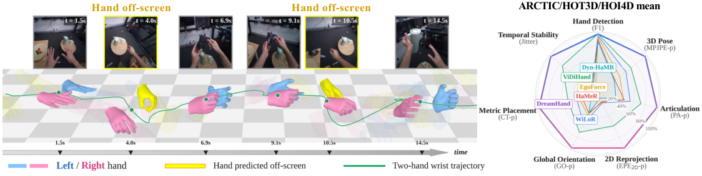
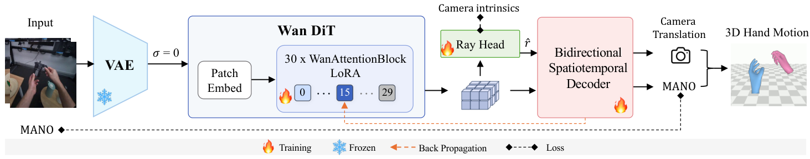

# DreamHand: Repurposing Video Diffusion Models for Occlusion-Robust Egocentric 3D Hand Motion Recovery


### [Project Page](https://ggxxii.github.io/dreamhand/) | [Paper (ArXiv)](https://arxiv.org/abs/2608.20308)


[Yufei Liu](https://ggxxii.github.io/)<sup>1,4</sup>,
Xixi Wang<sup>2</sup>,
[Hao Li](https://scholar.google.com/citations?view_op=list_works&hl=zh-CN&hl=zh-CN&user=D-8csxoAAAAJ)<sup>3,4</sup>,
[Ganlong Zhao](https://scholar.google.com/citations?user=4l2zOz4AAAAJ&hl=zh-CN)<sup>3,4</sup>,
Kaitong Cai<sup>4</sup>,
Chengkai Jin<sup>2,4</sup>,
Chunxiao Liu<sup>4</sup>,
Jianbo Liu<sup>4</sup>,
[Siyuan Huang](https://scholar.google.com/citations?user=QNkS4KEAAAAJ&hl=en)<sup>4</sup>&nbsp;&#8224;,
[Xingang Pan](https://xingangpan.github.io/)<sup>2</sup>,
[Hongsheng Li](https://scholar.google.com/citations?user=BN2Ze-QAAAAJ&hl=en)<sup>3,4</sup>&nbsp;&#9993;<br>


<sup>1</sup>SJTU, <sup>2</sup>NTU, <sup>3</sup>CUHK, <sup>4</sup>ACE Robotics &nbsp;&nbsp; <sub>&#8224; Project leader &nbsp; &#9993; Corresponding author</sub>

## Updates

[08/2026] Paper uploaded to arXiv. [](https://arxiv.org/abs/2608.20308)

## Abstract

Egocentric video offers scalable manipulation data for embodied AI, yet
recovering metric 3D hand trajectories remains challenging due to severe
object occlusion and frequent out-of-sight gaps. Existing single-frame and
windowed temporal regressors fail when hand shortly leaves the frame, while
recent video diffusion models (VDMs) rely on heavy, stochastic multi-step
sampling as pixel-space renderers. We instead repurpose VDM into a
deterministic geometry encoder. A single forward pass over the clean latent
exposes scene content beyond current observations, including occluded and out-
of-sight hands. We introduce DreamHand, an offline clip-level framework that
extracts features via a Deterministic Clean-Latent Encoder and decodes them
with a Bidirectional Spatiotemporal Decoder. DreamHand recovers continuous
bimanual trajectories with metric placement and no external detector, while a
Ray-Based Camera Solver supports a second configuration that needs no test-
time camera intrinsics. Across five egocentric benchmarks, DreamHand sets a
new state of the art, cutting MPJPE-p by 30% on occlusion-heavy ARCTIC and 40%
on HOT3D. These gains reach 46%–61% once out-of-sight hands are included in
the evaluation, offering a scalable path from everyday human video to robot
manipulation data.

## Method


Raw video is encoded into latents by the Wan VAE and processed by the Wan DiT
(σ=0). Block-15 features branch to the Ray Head and the Bidirectional
Spatiotemporal Decoder. Camera intrinsics supervise the Ray Head during
training. At test time they are discarded (K-free) or used only as the bearing
source in the translation solve (standard).

## TODO

- [x] [arXiv preprint](https://arxiv.org/abs/2608.20308)
- [x] [Project page](https://ggxxii.github.io/dreamhand/)
- [ ] Inference code
- [ ] Pretrained checkpoints — DreamHand (K-given) and DreamHand (K-free)
- [ ] Training code and data preparation scripts

The code and the pretrained checkpoints are not released yet. They will be
published in this repository; watch it for updates.

## Citation
If you find our work useful for your research, please consider citing the paper:
```
@misc{liu2026dreamhandrepurposingvideodiffusion,
      title={DreamHand: Repurposing Video Diffusion Models for Occlusion-Robust Egocentric 3D Hand Motion Recovery}, 
      author={Yufei Liu and Xixi Wang and Hao Li and Ganlong Zhao and Kaitong Cai and Chengkai Jin and Chunxiao Liu and Jianbo Liu and Siyuan Huang and Xingang Pan and Hongsheng Li},
      year={2026},
      eprint={2608.20308},
      archivePrefix={arXiv},
      primaryClass={cs.CV},
      url={https://arxiv.org/abs/2608.20308}, 
}
```

## License and Acknowledgements

The code will be released under the MIT License (see `LICENSE`). The Wan
backbone weights, the VideoX-Fun framework, the MANO hand model and the
training datasets are third-party assets under their own licences. This work
builds on [VideoX-Fun](https://github.com/aigc-apps/VideoX-Fun) /
[Wan](https://github.com/Wan-Video/Wan2.2) and
[smplx](https://github.com/vchoutas/smplx).
